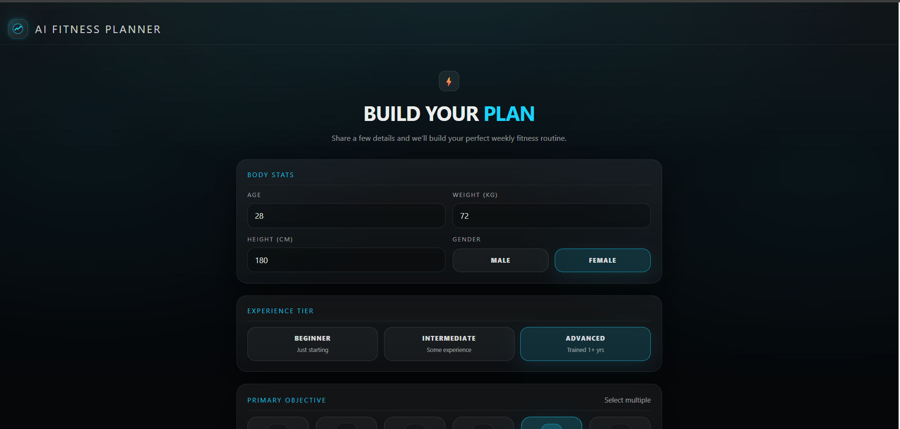
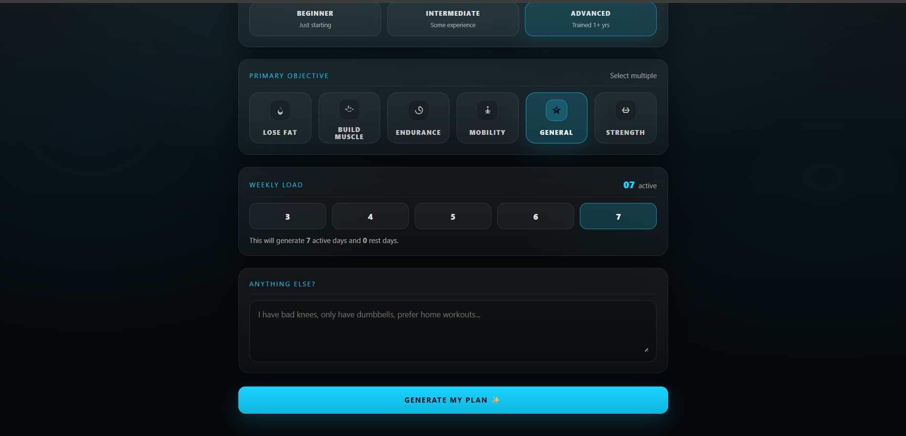
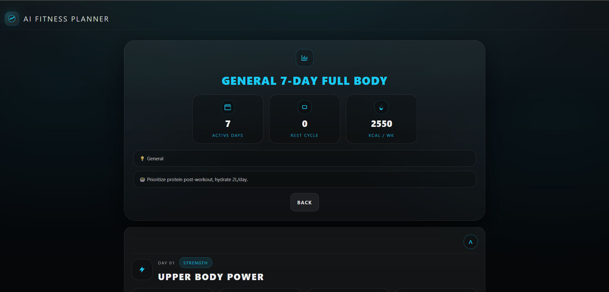
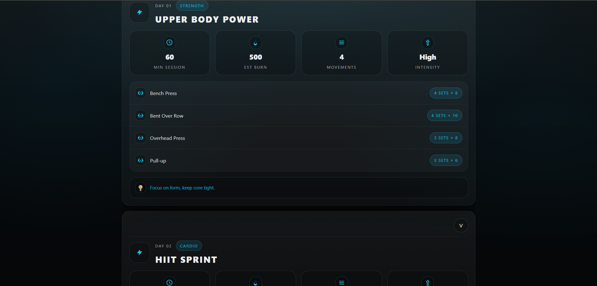

````md
# AI Fitness Planner

A responsive web application that generates a personalized **weekly fitness plan using AI**.  
Users provide basic personal information, fitness goals, and weekly availability, and the app generates a structured workout routine displayed using a clean, card-based UI (based on the provided Figma design).

This project emphasizes:

- Clean CSS and layout implementation (no UI frameworks)
- Structured AI responses (strict JSON schema)
- Robust error handling (API failures / malformed JSON)
- Responsive UI design (mobile-friendly)
- Maintainable architecture

---

## Demo

_Add your deployed link if available:_

https://your-deployment-link.vercel.app

---

## Features

### 1) Fitness Plan Generator

Users enter:

- Age, Weight, Height
- Gender
- Experience level
- Primary fitness goals (multi-select)
- Weekly workout load
- Optional notes / limitations

The AI generates a structured **7-day fitness plan**.

---

### 2) Structured AI Output (JSON-only)

The AI is instructed using a system prompt to always return JSON in the following format:

```json
{
  "plan_name": "string",
  "weekly_summary": {
    "total_days": 7,
    "rest_days": 0,
    "focus": "string"
  },
  "days": [
    {
      "day": "Monday",
      "type": "Strength | Cardio | HIIT | Yoga | Rest | Active Recovery | Flexibility",
      "title": "string",
      "duration_min": 45,
      "intensity": "Low | Medium | High | Max",
      "calories_est": 250,
      "exercises": [
        {
          "name": "string",
          "sets": 3,
          "reps": "8-10"
        }
      ],
      "tip": "string"
    }
  ],
  "nutrition_tip": "string",
  "recovery_tip": "string"
}
```
````

This structure allows the UI to render dynamic workout cards reliably.

---

### 3) Clean Card-Based UI

The generated plan displays:

- Weekly summary metrics
- Daily workout cards (accordion)
- Exercise lists
- Tips and recovery guidance

Each workout card includes:

- Session duration
- Estimated calorie burn
- Number of movements
- Workout intensity

---

### 4) Responsive Design (Mobile-Friendly)

The application is responsive and optimized for:

- Desktop
- Tablets
- Mobile devices

Key responsive behaviors:

- Experience tier becomes stacked/layered on mobile
- Objective tiles grid adjusts dynamically
- Workout stats collapse into fewer columns
- Exercise rows/pills wrap correctly on small screens
- No horizontal overflow

---

### 5) Robust Error Handling (No Crash Guarantee)

The app does not crash if:

- API returns non-200 responses
- Response is rate limited (429)
- Response contains extra text / markdown fences
- JSON is malformed
- JSON schema is missing or invalid

Includes:

- Retry with backoff (for 429 / transient errors)
- Timeout (prevents hanging)
- JSON extraction + validation before render
- Friendly error messages for users

Example user-friendly error:

> ⚠ The AI model is currently busy (rate-limited). Please wait a few seconds and try again.

---

## OpenRouter AI Integration

### API Endpoint

[https://openrouter.ai/api/v1/chat/completions](https://openrouter.ai/api/v1/chat/completions)

### Request Format

OpenAI-compatible chat completions:

- `system` message: strict JSON schema prompt
- `user` message: fitness details

### Model

Configurable via `.env`. Examples:

- `openai/gpt-oss-120b:free`
- `openai/gpt-oss-20b:free` (faster, often less rate-limited)

> Note: Some free models require enabling OpenRouter privacy options:
>
> - “Enable free endpoints that may train on inputs”
> - “Enable free endpoints that may publish prompts”

---

## Project Architecture

```text
src/
  api/
    openrouter.js       # OpenRouter fetch + retry + timeout
    parseJson.js         # Extract JSON safely from model output
    validatePlan.js      # Schema validation (defensive)
    systemPrompt.js      # Strict prompt enforcing JSON contract
  pages/
    BuildPlanPage/
      BuildPlanPage.jsx
      BuildPlanPage.css
    PlanPage/
      PlanPage.jsx
      PlanPage.css
  components/
    common/
      AppShell/
        AppShell.jsx
        AppShell.css
      Button/
        Button.jsx
        Button.css
      Card/
        Card.jsx
        Card.css
      Segmented/
        Segmented.jsx
        Segmented.css
      Input/
        Input.jsx
        Input.css
      NumberPill/
        NumberPill.jsx
        NumberPill.css
  styles/
    globals.css
    variables.css
```

### Page Responsibilities

| Page          | Responsibility                       |
| ------------- | ------------------------------------ |
| BuildPlanPage | Collect user input and generate plan |
| PlanPage      | Render AI-generated workout plan     |

---

## Tech Stack

- React
- Vite
- Vanilla CSS (no Tailwind / MUI / Shadcn / Ant Design)
- OpenRouter API

---

## Installation & Running

### 1) Clone the repository

```bash
git clone https://github.com/ashr77/ai-fitness-planner.git
cd ai-fitness-planner
```

### 2) Install dependencies

```bash
npm install
```

### 3) Create `.env` in project root (same folder as `package.json`)

```env
VITE_OPENROUTER_KEY=YOUR_OPENROUTER_KEY
VITE_OPENROUTER_MODEL=openai/gpt-oss-20b:free
```

> Do not commit `.env`. Use `.env.example` if needed.

### 4) Start the development server

```bash
npm run dev
```

App runs at:

- [http://localhost:5173](http://localhost:5173)

---

## Build & Preview

Create a production build:

```bash
npm run build
```

Preview production build:

```bash
npm run preview
```

---

## Testing Scenarios

### Input Coverage

Test cases:

- Valid inputs
- Extreme values
- Empty notes
- Multiple objectives selected
- Weekly loads 3–7

### API Behavior

| Scenario            | Expected Behavior            |
| ------------------- | ---------------------------- |
| Successful response | Renders plan                 |
| Malformed JSON      | Handled safely (shows error) |
| Rate limit (429)    | Retries + friendly error     |
| Slow network        | Loading spinner + timeout    |

### Responsive Testing

Tested using DevTools at:

- 320px, 360px, 375px, 390px
- 768px, 1024px, 1440px

No horizontal overflow check:

```js
document.documentElement.scrollWidth > window.innerWidth;
```

Expected: `false`

### Real Phone Testing (Optional)

Run:

```bash
npm run dev -- --host
```

Open on phone (same Wi-Fi):

```text
http://<your-pc-ip>:5173
```

---

## Known Limitations

- Free OpenRouter models may occasionally return **429 rate limits**
- AI responses may vary between runs
- Exercise recommendations are general fitness suggestions

---

## Screenshots

### Build Plan




### Weekly Plan




### Mobile View


---

## License

This project is provided for **educational and evaluation purposes**.

---

## Acknowledgements

- OpenRouter for LLM API access
- Figma design provided in the assignment
- React ecosystem for development tools

---

## ChatGPT Conversation Link

[https://chatgpt.com/share/69aa981e-6a94-8006-b743-c4968566dcbe]

```

```
